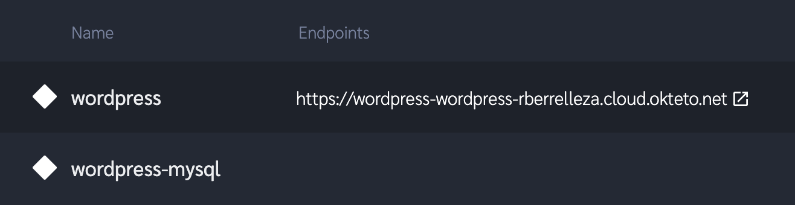
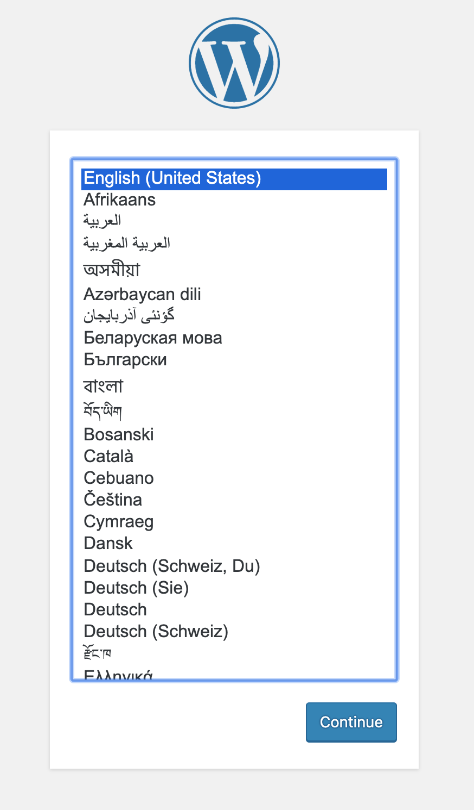

# wordpress-in-okteto

Run a Wordpress instance directly in Okteto

> This is adapted from the sample available at https://kubernetes.io/docs/tutorials/stateful-application/mysql-wordpress-persistent-volume/

1. Login to https://cloud.okteto.com
1. Download your Kubernetes credentials by clicking on the `Credentials` button in the far left of the screen.
1. On a terminal shell, set the `KUBECONFIG` env var to the location of the downloaded credentials credentials. 
        export KUBECTL=$HOME/Downloads/okteto-kube.config
1. Clone this repo
```
git clone git@github.com:rberrelleza/wordpress-in-okteto.git
```

5. Apply the manifests.
        
```
kubectl apply -k ./
```

```
secret/mysql-pass-c57bb4t7mf created
service/wordpress-mysql created
deployment.apps/wordpress-mysql created
deployment.apps/wordpress created
persistentvolumeclaim/mysql-pv-claim created
persistentvolumeclaim/wp-pv-claim created
```

6. Verify that the resources were correctly created

```
 kubectl get pod
 ```

 ```
 NAME                               READY   STATUS    RESTARTS   AGE
wordpress-78c9879d85-s5c6z         1/1     Running   0          11m
wordpress-mysql-868c686975-ld64c   1/1     Running   0          11m
```

7. Go back to https://cloud.okteto.com in your browser and click on the endpoint of your Wordpress instance.



8.You'll  see a WordPress set up page similar to one below.


> Do not leave your WordPress installation on this page. If other person finds it, they can set up a website on your instance and use it to serve malicious content. Finish the installation by creating a username and password or delete your instance.
